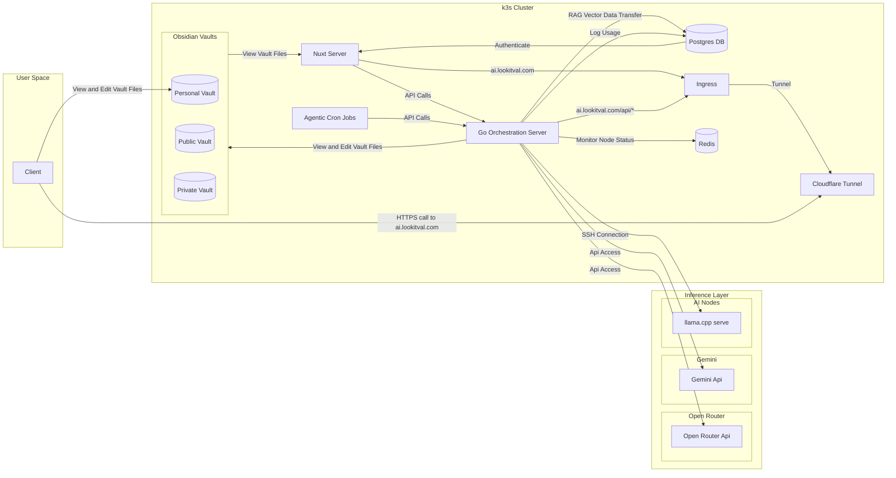
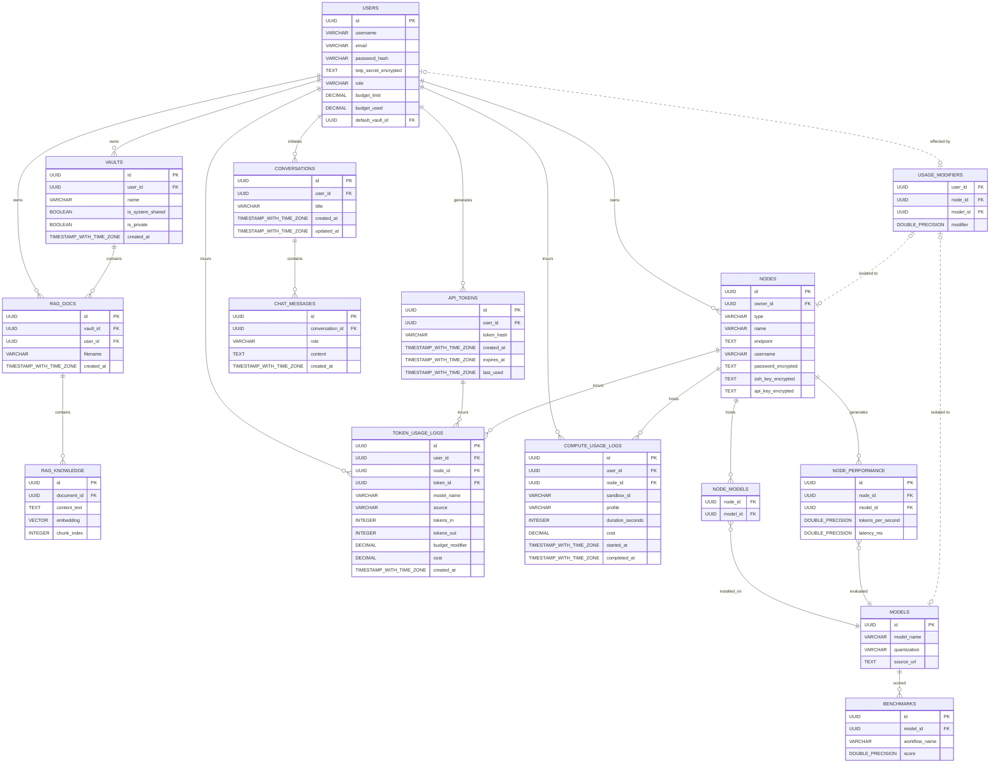
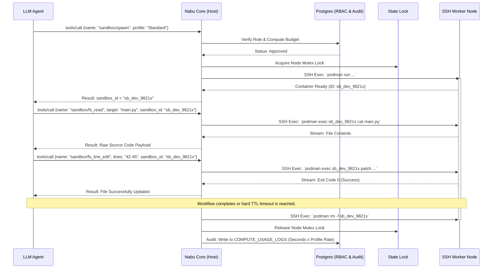

# Engineering Specification: Project Nabu

## 1. System Architecture & Abstract
This project defines an OpenAI-compatible API gateway written in Go designed for deployment in a k3s cluster. Unlike traditional inference servers, this system acts as a **Remote Compute Broker**. It manages the lifecycle of transient llama.cpp instances across a heterogeneous hardware pool via SSH, decoupling the Orchestration Logic (The Go project described in this document) from the Inference Logic (running on dedicated machines not within the k3s cluster).
### 1.1 Core Goals
- [ ] **Inference Orchestration**: Just-in-time provisioning of remote `llama.cpp` servers via automated SSH handshakes and process management.
- [ ] **Agentic Middleware**: Integration of Model Context Protocol (MCP) for tool-calling and autonomous system interaction.
- [ ] **Knowledge Retrieval (RAG)**: Built-in vector database integration matching the state of the Obsidian vault. Information should have layered permissions so that RAG can only be accessed by specific people, services, or systems.
- [ ] **API Compatibility**: Full Parity with OpenAI's v1 Specification to ensure drop-in compatibility with existing LLM tooling.
- [ ] **Model Management**: Monitor, Delete, and Add models onto different endpoints from the Hugging Face Repository via tool calls.
- [ ] **Custom Agentic Workflows**: Make custom endpoints that run agentic tasks and behaviors.
- [ ] **Account Management**: Allow private invite only access that only allows account registration with custom one time links.
- [ ] **Usage Monitoring & Budgeting**: Real-time token tracking with hard/soft quotas to prevent over-spending on third-party models (e.g., OpenRouter, Gemini).
- [ ] **Web accessible frontend**: A nuxt server on the cluster should be live on ai.lookitval.com (or maybe nabu.lookitval.com) to act as a private chatbot and access point for agentic monitoring.
### 1.2 System Design

### 1.3 Component Boundaries & Tech Stack
To live cleanly in a kubernetes environment, the system is strictly segmented into decoupled layers. Each component has a defined runtime environment and boundaries of responsibility.

| Component         | Responsibility                                                   |
| ----------------- | ---------------------------------------------------------------- |
| Nabu Core (Go)    | API Routing, SSH Lifecycle, State Lock Checking                  |
| Nabu Lense (Nuxt) | UI, Usage Monitor, Admin Console                                 |
| Redis             | Active Node Health Checks, Global State                          |
| PostgreSQL        | Audited Token Metrics, Users, Node Credential, Vector Embeddings |
#### 1.3.1 Nabu Core (Orchestration Server)
Nabu Core represents the active engine of the system. Written in Go, it runs within the k3s cluster environment as a stateless deployment.
- **API Framework**: `net/http` (stdlib) enhanced by [Gin Web Framework](https://gin-gonic.com/ "null") for efficient routing.
- **SSH Orchestration**: Native `golang.org/x/crypto/ssh` for secure, non-interactive remote process management.
- **Authentication & AuthN/AuthZ**:
    - **Password Hashing**: `golang.org/x/crypto/bcrypt` (industry standard for secure hashing).
    - **2FA (TOTP)**: [pquerna/otp](https://github.com/pquerna/otp "null") (minimal, battle-tested standard for TOTP).
    - **Automated Mail**: `net/smtp` (Go standard library) for SMTP transport and password reset flows.
- **MCP Integration**: Official [Model Context Protocol Go SDK](https://github.com/modelcontextprotocol/go-sdk "null").
- **Database Interaction**: `pgx` (PostgreSQL driver) for low-level, high-concurrency database queries.
- **State Management**: `go-redis` for distributed locking and node health synchronization.
#### 1.3.2 Nabu Lense (Web-Accessable Frontend)
Nabu Lens represents the visual user dashboard. Built as a single-page application (SPA), it acts as the interface for humans to chat with local models and monitor agentic tasks and behaviors.
- **Framework**: Nuxt 4 (Vue 3, TypeScript).
- **State Management**: [Pinia](https://pinia.vuejs.org/ ) for modular, complex reactive stores; native `useState` for simple, lightweight shared UI state.
- **Styling**: Tailwind CSS with semantic themes based on the Catppuccin palette.
- **Communication**: Native `fetch` API for REST calls; `EventSource` (SSE) for real-time streaming updates from the Core.
#### 1.3.3 Redis (Live State Management)
Redis serves as the dynamic memory broker of the system, running as a single-node StatefulSet inside the k3s cluster.
- **Technology**: [Redis Core](https://redis.io/ "null").
- **State Engine**: Stores ephemeral node lifecycles (`OFFLINE`, `PROVISIONING`, `READY`, `BUSY`, `TERMINATING`).
- **Distributed Locks**: Implements Redlock patterns via Nabu Core to prevent VRAM over-allocation.
- **TTL Management**: Handles short-lived keys for rate limiting and API session management.
#### 1.3.4 PostgreSQL (Persistent Data Storage, and Vector DB)
PostgreSQL handles all persistent relational and multi-dimensional state tracking, serving as the long term persistent storage.
- **Database**: PostgreSQL 15+.
- **Vector Engine**: [pgvector](https://github.com/pgvector/pgvector "null") for indexing and querying semantic embeddings.
- **Audit Logging**: Relational tables for token metrics, cost scaling, and usage history.
- **Identity & Access**: Secure tables for cryptographically hashed passwords (using bcrypt), TOTP seeds (encrypted at rest via app-level keys), and layered vector metadata for RAG permissions.
- **Security**: Identity/Access tables utilize bcrypt-hashed passwords and TOTP seeds encrypted at rest via application-level keys managed by K8s Secret injection.

## 2. Infrastructure, Compute, & Data
### 2.1 K3s Topology, Networking & Ingress
- **Ingress Controller**: Utilizes the native **Traefik Ingress Controller** bundled with k3s.
- **Routing Strategy**:
    - `PathPrefix(`/api`)` $\rightarrow$ Routes traffic to **[[#4. API Gateway & Total Endpoint Map|Nabu Core]]** (The Orchestrator).
    - `PathPrefix(`/`)` $\rightarrow$ Routes traffic to **[[#7. Presentation Layer (Nuxt UI)|Nabu Lens]]** (The Nuxt Frontend).
- **Edge Connectivity**: The cluster utilizes an existing `cloudflared` pod. Nabu services are configured to register as Tunnel targets, bypassing external firewall port-opening.
### 2.2 The Compute Broker (SSH Worker Pool & Redis State Locks)
- **Registration System**: Nodes are not hardcoded. The system provides an API/UI workflow where administrators register IPs, API keys, or SSH credentials.
- **Verification Lifecycle**:
    1. **Handshake**: The system initiates an authentication test against the provided target.
    2. **Environment Validation**: Runs pre-flight checks (e.g., verifying `llama.cpp` binary existence, checking CUDA/ROCm availability).
    3. **Registration**: Once validated, the node is added to the active registry in PostgreSQL.
- **Heterogeneous Support**: Supports local/remote SSH workers (llama.cpp) as well as managed API providers (OpenRouter, Gemini) via abstraction layers that unify token billing and error handling.
- **Security**: All credentials are encrypted using application-level keys mounted via Kubernetes Secrets, ensuring that even a database dump cannot expose plaintext API tokens or SSH keys.
### 2.3 Database Schemas (Postgres Relational & Vector DB/RAG)
- **Storage Layer**: NFS-backed persistent volume.
#### Entity Relationship Diagram

#### User & Auth

|Column|Type|Description|
|---|---|---|
|`id`|UUID|Primary Key|
|`username`|VARCHAR|Unique handle|
|`email`|VARCHAR|Required for password resets|
|`password_hash`|VARCHAR|Bcrypt hash|
|`totp_secret_encrypted`|TEXT|Encrypted at app layer|
|`role`|VARCHAR|'admin', 'user'|
|`budget_limit`|DECIMAL|Usage limit|
|`budget_used`|DECIMAL|Running total|
|`default_vault_id`|UUID|Optional default FK to Vaults|

#### API Tokens

|Column|Type|Description|
|---|---|---|
|`id`|UUID|Primary Key|
|`user_id`|UUID|FK to Users|
|`token_hash`|VARCHAR|Hashed version of the token|
|`created_at`|TIMESTAMP_WITH_TIME_ZONE|Creation time|
|`expires_at`|TIMESTAMP_WITH_TIME_ZONE|Expiration time|
|`last_used`|TIMESTAMP_WITH_TIME_ZONE|Last accessed for auditing|

#### Infrastructure (Nodes)

|Column|Type|Description|
|---|---|---|
|`id`|UUID|Primary Key|
|`owner_id`|UUID|FK to Users|
|`type`|VARCHAR|'ssh', 'api'|
|`name`|VARCHAR|Friendly name|
|`endpoint`|TEXT|Hostname/URI|
|`username`|VARCHAR|SSH user (if applicable)|
|`password_encrypted`|TEXT|Encrypted at app layer|
|`ssh_key_encrypted`|TEXT|Encrypted at app layer|
|`api_key_encrypted`|TEXT|Encrypted at app layer|

#### Models Registry

|Column|Type|Description|
|---|---|---|
|`id`|UUID|Primary Key|
|`model_name`|VARCHAR|HuggingFace/Llama name|
|`quantization`|VARCHAR|e.g. Q4_K_M|
|`source_url`|TEXT|Link to GGUF/Source|

#### Node-Model Accessibility

|Column|Type|Description|
|---|---|---|
|`node_id`|UUID|FK to Nodes|
|`model_id`|UUID|FK to Models|

#### Node Performance

|Column|Type|Description|
|---|---|---|
|`id`|UUID|Primary Key|
|`node_id`|UUID|FK to Nodes|
|`model_id`|UUID|FK to Models|
|`tokens_per_second`|DOUBLE_PRECISION|Throughput metric|
|`latency_ms`|DOUBLE_PRECISION|Response latency|

#### Benchmarks

|Column|Type|Description|
|---|---|---|
|`id`|UUID|Primary Key|
|`model_id`|UUID|FK to Models|
|`workflow_name`|VARCHAR|e.g. "Coding", "Summarization"|
|`score`|DOUBLE_PRECISION|Computed evaluation score|

#### Token Usage Logs (LLM Tracking)

|Column|Type|Description|
|---|---|---|
|`id`|UUID|Primary Key|
|`user_id`|UUID|FK to Users|
|`node_id`|UUID|FK to Nodes|
|`token_id`|UUID|FK to API_TOKENS|
|`model_name`|VARCHAR|Model identifier|
|`source`|VARCHAR|Source identifier|
|`tokens_in`|INTEGER|Input usage|
|`tokens_out`|INTEGER|Output usage|
|`budget_modifier`|DECIMAL|Optional calculated cost modifier|
|`cost`|DECIMAL|Calculated cost|
|`created_at`|TIMESTAMP_WITH_TIME_ZONE|Event timestamp|

#### Compute Usage Logs (Sandbox/VM Tracking)

|Column|Type|Description|
|---|---|---|
|`id`|UUID|Primary Key|
|`user_id`|UUID|FK to Users|
|`node_id`|UUID|FK to Nodes|
|`sandbox_id`|VARCHAR|Unique identifier for the ephemeral container session|
|`profile`|VARCHAR|Resource profile used (e.g., 'Micro', 'Standard')|
|`duration_seconds`|INTEGER|Total execution time in seconds|
|`cost`|DECIMAL|Calculated cost based on profile rate x duration|
|`started_at`|TIMESTAMP_WITH_TIME_ZONE|Boot time of the sandbox|
|`completed_at`|TIMESTAMP_WITH_TIME_ZONE|Teardown time of the sandbox|

#### Vaults

|Column|Type|Description|
|---|---|---|
|`id`|UUID|Primary Key|
|`user_id`|UUID|FK to Users (Owner)|
|`name`|VARCHAR|Logical name|
|`is_system_shared`|BOOLEAN|Available to all RAG queries globally?|
|`is_private`|BOOLEAN|Exclusive access?|
|`created_at`|TIMESTAMP_WITH_TIME_ZONE|Creation time|

#### RAG Documents

|Column|Type|Description|
|---|---|---|
|`id`|UUID|Primary Key|
|`vault_id`|UUID|FK to Vaults|
|`user_id`|UUID|FK to Users|
|`filename`|VARCHAR|Original name|
|`created_at`|TIMESTAMP_WITH_TIME_ZONE|Upload time|

#### RAG Knowledge

|Column|Type|Description|
|---|---|---|
|`id`|UUID|Primary Key|
|`document_id`|UUID|FK to RAG_Docs|
|`content_text`|TEXT|Raw string chunk|
|`embedding`|VECTOR|pgvector data|
|`chunk_index`|INTEGER|Order in document|

#### Conversations

|Column|Type|Description|
|---|---|---|
|`id`|UUID|Primary Key|
|`user_id`|UUID|FK to Users|
|`title`|VARCHAR|Auto-generated or user-defined session title|
|`created_at`|TIMESTAMP_WITH_TIME_ZONE|Creation timestamp|
|`updated_at`|TIMESTAMP_WITH_TIME_ZONE|Last message timestamp|

#### Chat Messages

| Column            | Type                     | Description                           |
| ----------------- | ------------------------ | ------------------------------------- |
| `id`              | UUID                     | Primary Key                           |
| `conversation_id` | UUID                     | FK to Conversations                   |
| `role`            | VARCHAR                  | 'user', 'assistant', 'system', 'tool' |
| `content`         | TEXT                     | Raw message payload                   |
| `created_at`      | TIMESTAMP_WITH_TIME_ZONE | Transmission timestamp                |
### 2.4 Vault Architecture & Knowledge Ingestion
The system isolates and operates over three distinct classifications of vaults:
1. **Public Vault (System-Shared)**:
    - **Content**: Markdown copies of public sources of truth (e.g., Wikipedia, official documentation).
    - **Access**: Available to all users' RAG pools, with filtering capabilities by source.
    - **Automation**: Populated and updated periodically via automated background ingestors (Kubernetes CronJobs pulling external assets).
2. **Private Vault (User Memories)**:
    - **Content**: Ephemeral memory, interaction history, and notes structured per user.
    - **Access**: Strictly private. Bound to the owning `user_id` and queryable only within their isolated RAG pipeline.
    - **Allocation**: Baseline allocation of exactly one private memory vault per user account.
3. **Personal Vaults (Co-Working Spaces)**:
    - **Content**: Fully linked local/personal Obsidian vaults.
    - **Access**: Bidirectionally visible and editable by both the user and Nabu agents.
    - **Agentic Integration**: Serves as the active canvas for co-authoring, project planning, and local agentic automation workflows.
    - **Allocation**: Optional; limited to exactly one personal vault per user, provisioned and scaled based on paid compute/resource tiers.

## 3. Security, Identity, & Permissions
### 3.1 Authentication Lifecycle (Invites, Registration, Sessions)
- **Registration**: Restricted via "Invite Only." Administrators generate one-time, cryptographically secure URLs.
- **Password/OTP Flow**: Passwords are cryptographically hashed using `bcrypt`. TOTP (2FA) is mandatory; seeds are stored in the `USERS` table, encrypted using an application-level Master Key (AES-GCM) injected via Kubernetes Secrets.
- **Sessions**: State is managed via `Secure`, `HttpOnly`, `SameSite=Strict` cookies to mitigate XSS/CSRF.
### 3.2 Role-Based Access Control (RBAC) & Tenant Scopes
- **Scopes**: All database queries are strictly scoped to the authenticated `user_id`.
- **RBAC**: Middleware inspects the user role (`admin` vs `donor` vs `user`) on every API request.
- **Isolation**: Administrative endpoints (e.g., node registration, global billing settings) are physically unreachable by non-admin roles at the middleware routing layer.
### 3.3 Layered RAG Permissions (Vector Metadata Filtering)
- **Metadata Enforcement**: Every query against `RAG_KNOWLEDGE` must include a mandatory `WHERE user_id = ?` clause.
- **Vault Isolation**: Queries can be further constrained by `vault_id`, allowing logical partitioning of knowledge (e.g., Private vs. Shared/System vaults).

## 4. API Gateway & Total Endpoint Map
All routes exist under the `/api/v1` path prefixes (for OpenAI parity) or `/api` (for system management), managed by the Gin framework within Nabu Core.
### 4.1 Standard Endpoints (OpenAI v1 Parity Map)
These endpoints guarantee drop-in compatibility with external applications (e.g., Obsidian plugins, IDEs). They require a valid Bearer Token linked to a User via the `API_TOKENS` table.

| Endpoint                   | Method | Scope/RBAC   | Description                                                                                                            |
| -------------------------- | ------ | ------------ | ---------------------------------------------------------------------------------------------------------------------- |
| `/api/v1/models`           | `GET`  | User / Token | Lists all active models accessible to the user across their authorized nodes.                                          |
| `/api/v1/chat/completions` | `POST` | User / Token | Processes chat generation. Intercepts payload to inject RAG context or MCP tool calls. _Enforces budget check._        |
| `/api/v1/embeddings`       | `POST` | User / Token | Generates vector embeddings for raw text input using an internal or managed embeddings model. _Enforces budget check._ |
### 4.2 Custom Agentic & Management Endpoints
#### Authentication & System Access (`/api/auth/*` & `/api/system/*`)

| Endpoint                 | Method | Scope/RBAC     | Description                                                                                          |
| ------------------------ | ------ | -------------- | ---------------------------------------------------------------------------------------------------- |
| `/api/auth/login`        | `POST` | Public         | Accepts credentials. Returns a temporary pre-auth state requiring TOTP.                              |
| `/api/auth/verify-totp`  | `POST` | Pre-Auth       | Validates the TOTP code. If successful, issues the `HttpOnly` session cookie.                        |
| `/api/auth/logout`       | `POST` | User           | Invalidates the active session cookie.                                                               |
| `/api/system/health`     | `GET`  | Admin / System | Monitors global system health, database connectivity, and active Redis queues.                       |
| `/api/system/usage`      | `GET`  | Admin          | Overall system usage: aggregates token flow and costs across all nodes and users globally.           |
| `/api/system/auth-audit` | `GET`  | Admin          | System auth monitoring: tracks failed login attempts, successful authentications, and TOTP failures. |
#### User Profiles & Resource Scopes (`/api/users/:id/*`)
_All user-specific queries are grouped under the user's ID. Users can only query their own ID unless they possess the `admin` role._

| Endpoint                         | Method       | Scope/RBAC          | Description                                                                     |
| -------------------------------- | ------------ | ------------------- | ------------------------------------------------------------------------------- |
| `/api/users/invite`              | `POST`       | Admin               | Generates a secure, one-time registration link for onboarding new accounts.     |
| `/api/users/:id`                 | `GET`        | User (Self) / Admin | Returns the specified user's profile, roles, and basic configuration.           |
| `/api/users/:id/tokens`          | `GET` `POST` | User (Self) / Admin | Lists active API key metadata, or generates a new API token for this account.   |
| `/api/users/:id/tokens/:tokenId` | `DELETE`     | User (Self) / Admin | Revokes a specific API token.                                                   |
| `/api/users/:id/usage`           | `GET`        | User (Self) / Admin | Retrieves personal token/cost usage logs strictly scoped to this user.          |
| `/api/users/:id/budget`          | `GET` `PUT`  | User (Self) / Admin | GET checks running budget. PUT (Admin Only) allows updating the `budget_limit`. |
#### Compute Node Broker (`/api/nodes/*`)

|Endpoint|Method|Scope/RBAC|Description|
|---|---|---|---|
|`/api/nodes`|`GET`|Admin|Lists all registered compute nodes and external API endpoints.|
|`/api/nodes/register`|`POST`|Admin|Submits new node credentials. Validates the connection before saving to Postgres.|
|`/api/nodes/:id`|`DELETE`|Admin|Removes a node from the orchestration pool.|
|`/api/nodes/status`|`GET`|Admin / UI|Streams or polls live node health and queue states from Redis.|
|`/api/nodes/:id/models`|`GET`|User / Admin|Lists models explicitly accessible or installed on the specific node.|
#### Vaults & RAG Operations (`/api/vaults/*` & `/api/rag/*`)

| Endpoint          | Method | Scope/RBAC   | Description                                                                                       |
| ----------------- | ------ | ------------ | ------------------------------------------------------------------------------------------------- |
| `/api/vaults`     | `GET`  | User         | Lists vaults accessible to the user.                                                              |
| `/api/vaults/:id` | `GET`  | User         | Retrieves specific details of a vault ID.                                                         |
| `/api/rag/ingest` | `POST` | User / Agent | Accepts raw Markdown/text, chunks it, embeds it, and saves it to a specific `vault_id`.           |
| `/api/rag/query`  | `POST` | User / Token | Direct semantic search endpoint. Returns relevant database chunks without passing them to an LLM. |
#### Agentic Task Management (`/api/tasks/*`)
_The task orchestrator handles multiple concurrent lifecycle processes. Tasks are limited to users with active Personal Vault subscriptions._

| Endpoint            | Method | Scope/RBAC | Description                                                                               |
| ------------------- | ------ | ---------- | ----------------------------------------------------------------------------------------- |
| `/api/tasks`        | `GET`  | Donor      | Lists all active/queued background tasks.                                                 |
| `/api/tasks/:id`    | `GET`  | Donor      | Returns status, logs, and progress for a specific task.                                   |
| `/api/tasks`        | `POST` | Donor      | Triggers automated tasks (e.g., `{ "task": "benchmark", "args": { "hf_path": "..." } }`). |
| `/api/tasks/stream` | `GET`  | Donor      | SSE Stream for live task execution logs, heartbeat, and progress monitoring.              |
| `/api/tasks/help`   | `GET`  | Donor      | Lists all possible tasks avaliable.                                                       |
### 4.3 Request Lifecycle: Streaming (SSE), Middlewares, & Token Auditing
To maintain system integrity and prevent runaway costs, every incoming request bound for inference (`/api/v1/chat/completions`) passes through a strict middleware chain:
1. **Identity & Auth**: The request is evaluated for either a valid Nuxt Session Cookie or a valid Bearer API Token.
2. **Budget Verification**: Nabu Core calculates the user's `budget_used` against their `budget_limit`. If exceeded, the request is instantly rejected (402 Payment Required).
3. **Agentic Interception (Optional)**: If the request requires RAG or tool-calling, Nabu silently queries the database/MCP registry, injects the context into the prompt, and formats the tool definitions.
4. **Proxy & Stream Execution**: The final prompt is passed to the selected Node (SSH llama.cpp or OpenRouter). The response is proxied back to the user via Server-Sent Events (SSE).
5. **Post-Completion Audit**: Upon stream closure, the exact token count (Input + Output) and calculated model cost is logged to the `USAGE_LOGS` table and added to the user's running budget.

## 5. Model Context Protocol (MCP) Subsystem
### 5.1 MCP Host Architecture & Integration

Nabu Core implements the official Model Context Protocol (MCP) Go SDK to act as an **MCP Host**. In this configuration, Nabu Core acts as the centralized coordinator, exposing a unified interface to the client UI (Nabu Lens) or CLI agents, while managing connectivity out to individual local and remote resource executors.

- **Decoupled Architecture**: The MCP execution subsystem operates entirely within the backend orchestration tier. It exposes no raw JSON-RPC or SSE transport endpoints to the client UI (Nabu Lens). Nabu Lens interacts with active tasks exclusively through standard HTTP REST and stateful WebSocket telemetry streams managed by Nabu Core.
    
- **Concurrency Model**: High-performance Go goroutines handle concurrent tool invocations. The host uses non-blocking read/write loops for stdin/stdout multiplexing on processes running locally in the cluster.
    

### 5.2 Tool Execution Flow
This sequence diagram defines the lifecycle of a tool call initiated by an agent.

### 5.3 Execution Boundaries & Tool Security Constraints

To maintain absolute system safety during autonomous agent workflows, Nabu enforces strict security boundaries utilizing the **Remote Sandbox Execution Model**.

- **Sandboxing**: Code execution tasks (compiling repositories, running unit tests) are strictly prohibited from executing directly within Nabu Core or the k3s cluster. Instead, Nabu Core establishes an SSH tunnel to an external AI node and boots a transient, isolated Podman/Docker container with restricted user privileges.
    
- **Node Compute Profiles**: When a task requests an execution environment via `sandbox/spawn`, Nabu Core provisions the container based on two distinct resource blueprints:
    

| Profile        | CPU Max | RAM Max | Target Workloads                                                                   |
| -------------- | ------- | ------- | ---------------------------------------------------------------------------------- |
| **`Micro`**    | 1 Core  | 1 GB    | Text manipulation, utility scripts, math operations.                               |
| **`Small`**    | 2 Cores | 2 GB    |                                                                                    |
| **`Standard`** | 4 Cores | 8 GB    | Workspace dev tasks, codebase compilation, dependency updates, and package audits. |

- **Lifecycle Network Routing Matrix**: To resolve dependency retrieval bottlenecks without compromising host network security, containers navigate two explicit lifecycles:
    
    1. **Hydration Phase (Outbound WAN Only)**: During initialization (e.g., `git clone`, `npm install`, Hugging Face model pull), the sandbox is granted outbound network access restricted entirely to public domains via public DNS. All private intranet CIDR blocks (e.g., `10.0.0.0/8`, `192.168.0.0/16`) are explicitly dropped at the container firewall boundary.
        
    2. **Runtime Phase (Isolated)**: Once dependencies are pulled and workspace setup is complete, Nabu Core cuts external WAN access before running untrusted or agent-generated scripts, enforcing an isolated loopback configuration.
        
- **Process Lifespans**: Every remote process must inherit a hard execution timeout managed by Go's `context.WithTimeout` (default: 30 seconds). Orphaned or hanging SSH sessions are actively tracked and killed during Redis-managed keep-alive runs.
    
- **Filesystem Isolation**: Code sandboxes use read-only parent mounts and isolated write-accessible workspaces. Project modifications are isolated to the specific cloned git directory. Agents can only publish changes back to Git via controlled Pull Request branches, requiring explicit human reviews.
    

### 5.4 Signal Communication Protocol
Nabu comes equip with a Signal interface that the mcp server can use to send messages to the user for some kind of interjection. These should be kept to a minimum, and schedulable. Nabu should also be able to communicate via its own personal email address that it should be able to both send and receive from.

### 5.5 Core Toolset Registry

The following table registers the functional MCP tools exposed by Nabu. Tools requiring a developer workspace must execute inside an active container environment spawned via `sandbox/spawn`.

| Tool Namespace               | Functionality         | Description                                                                                                                                                                                       |
| ---------------------------- | --------------------- | ------------------------------------------------------------------------------------------------------------------------------------------------------------------------------------------------- |
| **`sandbox/spawn`**          | Environment Lifecycle | Boots a fresh, isolated Podman container. Supports optional arguments for initial `git_url`, `branch`, and `bootstrap_cmd` to automatically configure workspaces.                                 |
| **`sandbox/dep_install`**    | Dependency Ingest     | **Toggled Net Ingestion**: Temporarily enables outbound WAN access, executes standard package installers (`go get`, `npm install`, `pip install`), and instantly cuts WAN access upon completion. |
| **`sandbox/exec`**           | Code Execution        | Runs shell scripts, Python, or Node code _strictly inside_ the specified container environment.                                                                                                   |
| **`sandbox/fs_read`**        | Sandbox File Op       | Reads full content or a targeted chunk (line boundaries) of a file in the workspace.                                                                                                              |
| **`sandbox/fs_write`**       | Sandbox File Op       | Direct atomic write/overwrite for creating new scripts or assets inside the sandbox.                                                                                                              |
| **`sandbox/fs_line_edit`**   | Sandbox File Op       | **Surgical Edit:** Modifies targeted line numbers in an existing file to prevent model truncation.                                                                                                |
| **`sandbox/fs_search_grep`** | Sandbox File Op       | **Code Search:** Scans the entire workspace using regex or string matches to find definitions.                                                                                                    |
| **`sandbox/git`**            | Repo Management       | Handles local git configuration, cloning, committing, and upstream pull requests.                                                                                                                 |
| **`vault/list_tree`**        | Knowledge Graph       | Generates a full recursive directory tree mapping of the user's active markdown vault.                                                                                                            |
| **`vault/read_note`**        | Knowledge Graph       | Retrieves the raw markdown body text of a targeted note via its relative path.                                                                                                                    |
| **`vault/patch_note`**       | Knowledge Graph       | Standardized section patching or timestamped appending for logging thoughts and syncing files.                                                                                                    |
| **`vault/search`**           | Vector / RAG          | Executes a fast vector similarity search directly across the vault's embedded index.                                                                                                              |
| `email/check`                | Communication         | Check for unopened emails                                                                                                                                                                         |
| `email/send`                 | Communication         | Schedule an email to be sent                                                                                                                                                                      |
| `message/check`              | Communication         | Check for unopened signal messages                                                                                                                                                                |
| `message/send`               | Communication         | Schedule a signal message to be sent                                                                                                                                                              |
| **`web/scrape`**             | Global Utility        | Extracts raw DOM from any external URL, cleans it, and transforms it into markdown text.                                                                                                          |
| **`web/net_check`**          | Global Utility        | **Network Diagnosis:** Lightweight tool to perform DNS resolutions, ping checks, or port status checks.                                                                                           |
| **`compute/calc`**           | Global Utility        | Fast mathematical parser to evaluate arithmetic, logic, and equations natively.                                                                                                                   |
| **`compute/json_parse`**     | Global Utility        | Validates, minifies, or extracts deep keys from complex structural data blocks.                                                                                                                   |
| **`system/count_tokens`**    | Global Utility        | Evaluates the precise length of a text snippet using target model tokenizers to manage context budgets.                                                                                           |
## 6. Workflows & Orchestration
The central agentic behaviors happen through workflows. These  are user-defined procedures mapped into **Directed Acyclic Graphs**, transitioning context dynamically between specialized Personas while enforcing safety limits on execution cycles.
### 6.1 Workflow Persistence & JSON Schemas
Rather than hardcoding procedures into the Go binary, Nabu defines workflows as modular JSON templates stored within the user's private config vaults.
- **Directed Acyclic Graphs (DAGs)**: While standard workflows flow sequentially toward a final objective, they are fundamentally cyclic. The workflow schema supports backward-pointing state transitions.
- **Specialized Gated Nodes**: Custom gates are set within workflows to prevent passing nodes without the approval of multiple Personas that are judging the step across different criteria
	- **All Gates must be passed to move on**
	- **All Gates require their own benchmark and score requirement to ensure the models are capable of judging decisions to proper standards**
	- **All Gated nodes require a failure clause that happens in the event of a failure loop**
- **UI Customization**: The `Nabu Lens` frontend parses these JSON files, exposing a "Workflow Editor" where users can visually map transitions, tweak consensus thresholds, and inject custom validation nodes.
### 6.2 Context Fragmentation & The Scratchpad
To prevent context bloat and keep inference speeds fast on smaller, localized models, Nabu isolates workspace state using a dynamic scratchpad technique.
- **`scratchpad.md`**: Upon spawning any workflow, Nabu Core generates a dedicated scratchpad markdown file inside the private obsidian vault localized to the user and this project. This file serves as the system's "working memory" and reasoning ledger.
- **Inter-Persona Communication**: Personas do not dump their entire conversational histories into the next agent's prompt. Instead, they are strictly instructed via system guidelines to write summaries of their actions, reasoning, critiques, and explicit approval logs directly into the shared scratchpad.
- **State Injection**: Before invoking the next Persona in the sequence, Nabu Core parses the updated scratchpad file and injects its contents as system context. This allows a downstream Auditor to inspect the exact trace of _why_ an upstream Scribe proposed a specific code patch, without needing to process the thousands of tokens from the Scribe's raw conversational history.
- **Graceful Shutdown and Continue**: Workflows can be shutdown which will trigger an attempted savestate, where an analaysis is run to see if any existing environments changes need to be saved with git and the environment will be copied onto long term storage and an update is added to the scratchpad to help continue where was last let off. On continuing the workflow will rebuild the environment from the save, verify its functionality, and then continue the workflow from where was left off. On completion of the workflow, the stored environment will be deleted.
### 6.3 Workflow Scheduling
Workflows are scheduled an automated queuing system that takes many things into account. 
- Workflows will be queued by date 
- Workflows will recieve time expectations based on similar workflows that have finished in the past. 
- This means that all workflows will be benchmarked carefully based on every step of the workflow process. 
- There can be multiple queues configured via a json file
- Different queues can have different priority, and level of importance for going through them, and can prioritize use of specific machines to pull of parallel processing better.
### 6.4 Configurable Review Gates & Quorums
Workflows enforce compliance through a series of sequential, stateful check-points defined as **Review Gates**. No changes are committed out of the sandbox to the master Git repository or the permanent Obsidian Vault until all gates are satisfied.
- **Gate Configurations**: Gates are declared directly in the workflow's JSON template. They are localized to specific issues, allowing specialized personas to verify the output against strict criteria.
- **Self-Healing Loopback**: If an automated gate rejects a proposed step (e.g., the `CodeQualityReviewer` flags a syntax error), the engine catches the rejection, increments the loop's retry counter, and routes the rejection reasons directly back to the writing persona alongside the current scratchpad for automatic refinement. 
- **Explicit on failure functions**: If the loopback fails after the max number of repeats, it is then sent to another persona which will do something with the workflow, weather that be asking for help, going back to the beginning with notes, breaking the problem into smaller problems, or simply logging the failure for future attempts.
### 6.5 Example Workflows
#### 6.5.1 Workflow Example 1: Vault Synthesis & Daily Triage
**Objective**: Analyze vault activity, categorize projects, and generate actionable task lists. 
**Node Compute Profile**: `micro`
**Target**: Automatically defaults to recent vault changes
*This could be expanded! This is just a start before expanding in Nabu Lens*
1. **Context Ingestion** (Persona: `Researcher`)
    - **Action**: Uses `vault/search` and `vault/list_tree` to identify all notes modified in the last 24 hours.
2. **Project Grouping** (Persona: `Project Manager`)
    - **Action**: Reads the scratchpad. Categorizes changes into distinct projects. Extracts explicit "to-dos" or "bugs" documented in notes.
    - **Output**: Generates a structured JSON array of actionable tasks.
3. **Reporting** (Persona: `Technical Writer`)
	- **Action**: Reviews the categorized tasks and generated JSON.
    - **Output**: Logs a clean, formatted daily summary into the main Obsidian vault.
#### 6.5.2 Workflow Example 2: Feature Implementation
**Objective**: Implement, verify, and document a new feature through a series of automated gates.
**Node Compute Profile**: `standard`
**Target**: Project that can be opened in an isolated environment, A feature change or fix.
1. **Feature Scoping** (Persona: `Architect`)
    - **Action**: Reads the feature request. Identifies target files. Writes technical specifications and scope boundaries into the scratchpad.
2. **Test Generation** (Persona: `Quality Assurance`)
    - **Action**: Reads the scratchpad; appends or modifies unit tests to ensure coverage of the new feature or bug.
	1. **Test Quality Review Gate** (Persona: `Code Reviewer`)
	    - **Action**: Reviews unit tests for algorithmic complexity and style consistency.
3. **Implementation** (Persona: `Developer`)
    - **Action**: Reads the scratchpad and modifies the codebase to add the feature. Executes unit tests via `sandbox/exec` until the exit code is `0`.
	1. **Visual Verification Gate** (Persona: `Designer`)
	    - **Action**: Reviews visual diffs (or Playwright snapshots) against style standards.
	2. **Code Quality Review Gate** (Persona: `Code Reviewer`)
	    - **Action**: Reviews diffs for algorithmic complexity and style consistency.
	3. **Security Audit Gate** (Persona: `Security Auditor`)
	    - **Action**: Scans implementation for OWASP vulnerabilities, unsanitized inputs, or exposed secrets.
	4. **SEO & Accessibility Gate** (Persona: `SEO Auditor`)
		- **Action**: Reviews diffs for SEO and Accessibility issue that should be solved before moving forward. 
	5. **Architecture Validation Gate** (Persona: `Architect`)
		- **Action**: Reviews initial specs against the final diff and all gate logs. Validates that the core requirements were met without regressions. If they are not the entire workflow is scrapped and set to rerun.
4. **Documentation & Integration** (Persona: `Release Manager`)
    - **Action**: Writes the pull request description and updates relevant architecture notes in the Obsidian vault.
#### 6.5.3 Workflow Example 3: Automated Package Updates
**Objective**: Detect and patch insecure dependencies while maintaining system stability.
**Node Compute Profile**: `standard`
**Target**: Project that can be opened in an isolated environment
1. **Security Auditor (Audit)**
    - **Action**: Analyzes the vulnerability report and the target dependency in the vault.
2. **Developer (Implement)**
    - **Action**: Reads the scratchpad, updates the dependency, and runs build scripts, and solve any errors that pop up.
	1. **Functionality Verification Gate**:
		- **Action**: Reviews the app and verifies the functionality of other features.
	2. **Code Quality Gate (Persona: `Code Reviewer`)**
	    - **Action**: Reviews Unit tests for algorithmic complexity and style consistency. 
	3. **Security Audit Gate (Persona: `Security Auditor`)**
	    - **Action**: Scans implementation for OWASP vulnerabilities, unsanitized inputs, or exposed secrets.
3. **Reporting (Submit)**
    - **Action**: Logs the changes made 
#### 6.5.4 Workflow Example 4: Automated Documentation Updates
**Objective**: Ensure internal documentation matches the current implementation.
**Node Compute Profile**: `micro`
**Target**: Project that can be opened in an isolated environment
1. **Technical Writer (Analyze)**
       - **Action**: Compares the codebase diffs with the current documentation in the vault.
    - **Output**: Drafts documentation changes into the scratchpad.
2. **Technical Writer (Draft)**
    - **Action**: Writes the updated docs, ensuring compliance with the project’s documentation standards.
	1. **Tone Gate (Edit)**
		- **Action**: Ensure tone and voice consistency with the documentation provided.
	2. **Architect (Verify)**
	    - **Action**: Validates that the documentation accurately reflects the system architecture and logic changes.
3. **Reporting (Submit)**
    - **Action**: Updates the vault files and signals readiness for final human approval.
#### 6.5.5 Workflow Example 5: Blog Post Sketch
**Objective**: Transform raw thought notes into a polished draft.
**Node Compute Profile**: `micro`
**Target**: Topic at hand to base the post on
1. **Research Analyst (Gather)**
    - **Action**: Searches the vault for relevant notes, previous context, and supporting documentation.
    - **Output**: Aggregates context into the scratchpad.
2. **Technical Writer (Draft)**
    - **Action**: Writes the first draft based on the research provided.
	1. **Tone Gate (Edit)**
		- **Action**: Ensure tone and voice consistency with the documentation provided.
	2. **Fact Check**
		- **Action**: Ensure the validity of the passages via web searches and documentation verification.
	3. **Architect (Verify)**
	    - **Action**: Validates that the documentation accurately reflects the system architecture of the topic if it is in reference to existing projects.
3. **Summarize and Market**
	- **Action**: Write a summary of the blog post to be able to post on linked in to call attention to the blog.
4. **Integrator (Finalize)**
    - **Action**: Saves the final draft to the "Drafts" folder for human review.
#### 6.5.6 Workflow Example 6: Analyze Systems and Propose Updates
**Objective**: Identify system bottlenecks, technical debt, or architectural improvements.
**Node Compute Profile**: `micro`
**Target**: Project that can be opened in an isolated environment
1. **Architect (Audit)**
    - **Action**: Scans projects for areas that are incomplete, could use improvment, or have errors or flaws in some way; or areas of the project that have not been implimented or planned that could improve the usability, performance, or use cases of this project
2. **Research Solutiuons**:
	- **Action**: Research what other people are doing online with this
3. **Formulate Improvement Plan**
	- **Action**: Sketch together a document of what could be done to improve the areas at hand, and how other people have solved this problem, and what it would actually do to improve the project.
	1. **Security Auditor (Review)**
	    - **Action**: Checks the proposed improvement plan for security regressions.
	2. **Need Check**
		- **Action**: Ensure the proposal actually solves a need that is not addressed across anything else in the existing setup or documentation.
4. **Developer (Plan)**
    - **Action**: Converts the improvement plan into a series of actionable, high-level engineering tasks.
5. **Integrator (Finalize)**
    - **Action**: Reviews the final plan and submits the "Proposed Updates" report for human authorization.

## 7. The Persona Registry

To execute complex agentic workflows, Nabu moves beyond static system prompts into a registry of specialized **Personas**. Personas are capability-scored entities designed to act as specific nodes within a reasoning graph.

### 7.1 Persona Architecture & Benchmark Routing

### 7.2 Core Persona Archetypes

## 8. Continuous Benchmarking & Evaluation Pipeline

To ensure the Cognitive Engine accurately routes tasks to capable models, Nabu implements a custom, deterministic benchmarking pipeline natively integrated into its orchestration engine.

### 8.1 Benchmark Structure & Versioning

Because the difficulty of an agentic workflow changes as tasks become more complex, scores are strictly version-controlled.

- **Version Immutable Logs**: When a model is tested, its score is saved to the `BENCHMARKS` table alongside the exact test version (e.g., `v1.2`).
    
- **Test Fixtures**: Custom benchmarks consist of an input state (prompt/files), a Persona Target, and a definitive Ground Truth/Pass criteria.
    

### 8.2 Evaluation Strategies

The pipeline prioritizes deterministic evaluation to measure _action reliability_ over trivial knowledge.

1. **Deterministic Assertions (High Priority)**:
    
    - _Structural_: Did the model return valid JSON matching the required schema?
        
    - _Regex/AST_: Did the model correctly format the specific git command?
        
    - _Functional (Sandbox Integration)_: Nabu boots a `Compute` sandbox, injects the model's generated script, runs a test framework (e.g., `pytest`), and grades based strictly on the exit code (0 = Pass, >0 = Fail).
        
2. **LLM-as-a-Judge (Qualitative Scoring)**:
    
    - For nuanced evaluations (e.g., auditing the clarity of an explanation), Nabu proxies the local model's output to a high-tier remote reasoning model (e.g., OpenRouter GPT-4o) with a strict grading rubric to calculate a normalized score.
        
3. **Public Harness Integration (Baselines)**:
    
    - To establish standard capability, the orchestration engine automates the deployment of standard frameworks (e.g., **EleutherAI LM Evaluation Harness**, **HumanEval**) inside its compute sandboxes to test against academic baselines natively.
        

### 8.3 Execution Lifecycle

Benchmarking operates as a background orchestration task.

- Upon registering a new Hugging Face model, an administrator triggers a `POST /api/tasks` payload requesting a `benchmark_suite` run.
    
- Nabu spins up an isolated sandbox, processes the versioned test suites, updates the `BENCHMARKS` PostgreSQL registry, and instantly adjusts the live routing logic for future DAG execution.
    

## 9. Presentation Layer (Nuxt UI)

### 9.1 Chat UI 
#### 9.1.1 Canvas and Sketch Environments

### 9.2 Workflow Monitoring
 
### 9.3 Workflow Editor

### 9.4 Node Configuration

### 9.5 User Data, Usage, and Account Control

### 9.6 Admin Dashboard 

### 9.7 New Users, Login & Account Registry

## 10. Development Roadmap
### 10.1 Iterative Milestones (v0.1.0 to v1.0.0)

#### Milestone 1: Routing Basic Requests
- **Goal**: Establish the Go backend and basic Gin API framework.
- **Story Points**: **3 Points**
- **Definition of Done**:
	- A cURL request from the terminal successfully streams a response back from the model through the Go router.
	- Basic leaky bucket rate monitoring implemented in redis DB
#### Milestone 2: Basic Lens 
- **Goal**: Establish the Nuxt 4 frontend and basic state management.
- **Story Points**: **5 Points**
- **Definition of Done**: 
	- A user can type a message in the web browser, hit enter, and watch the AI response stream live into the chat interface.
#### Milestone 3: Introduce DB and Node Registration System
- **Goal**: Introduce the PostgreSQL database and dynamic inference routing.
- **Story Points**: **5 Points**
- **Definition of Done**: 
	- The router queries the database to find an available node before sending the request, successfully utilizing dynamic configuration.
	- Requests can be routed between different nodes manually
	- Nodes can be monitored via Lens, and models can be added and removed from the web view
#### Milestone 4: Expand Database and RAG
- **Goal**: Integrate `pgvector` and the Obsidian vault connection, and make sure Database structures are ready.
- **Story Points**: **8 Points**
- **Definition of Done**:
	- Asking the chatbot a question about a specific, private file in the Obsidian vault yields a highly accurate, cited response.
	- Chats now have persistent memory and multiple new chats can be created in Lens
#### Milestone 5: Basic MCP
- **Goal**: Implement the official Go-SDK for Model Context Protocol with basic tools.
- **Story Points**: **5 Points**
- **Definition of Done**:
	- Asking the AI "What is 423 * 18" causes it to pause the stream, execute the Go math tool, and return the exact integer.
	- Tools should be manually queryable via an admin tool in Nabu Lens
#### Milestone 6: Closed Agentic Developer Environments
- **Goal**: Enable secure, remote code execution.
- **Story Points**: **13 Points**
- **Definition of Done**:
	- Manual Environments can be opened with admin tools and navigated through
	- Environments can successfully download necessary tools but will not be exposed to the internet otherwise
#### Milestone 7: Signal Chat and Email
- **Goal**: Enable asynchronous communication channels for the agents.
- **Story Points**: **5 Points**
- **Definition of Done**: A background script can trigger an email or a Signal message to the user's phone confirming a task is complete.
#### Milestone 8: Account Management
- **Goal**: Lock down the system for public-facing deployments.
- **Story Points**: **8 Points**
- **Definition of Done**: 
	- Nabu Lens redirects to a secure login page.
	- Unauthenticated requests to the `/api` routes return a strict `401 Unauthorized`.
	- Account verification via email responses, and password resetting are functional
#### Milestone 9: Benchmarking Workflows
- **Goal**: Automate model scoring and ability to setup custom benchmarks for specific workflows.
- **Story Points**: **13 Points**
- **Definition of Done**: 
	- Running a single command boots a model, tests it against 10 logic queries, and saves the score to the database.
	- Custom benchmarks can be built in Lens
	- Models can be benchmarked in bulk as workflows.
#### Milestone 10: Custom Agentic Workflows
- **Goal**: The core agent engine. Execute multi-step DAG JSON templates.
- **Story Points**: **20 Points**
- **Definition of Done**:
	- Ability to create custom workflows in a Lens editor
	- Ability to view and monitor current and scheduled workflows
#### Milestone 11: Usage Monitoring and Administrative Control 
- **Goal**: Prevent runaway costs and track resource usage.
- **Story Points**: **8 Points**
- **Definition of Done**:
	- Lens will show usage statistics broken down in a variety of different breakdowns
	- Admins can set usage limits on different users, for different types of requests.